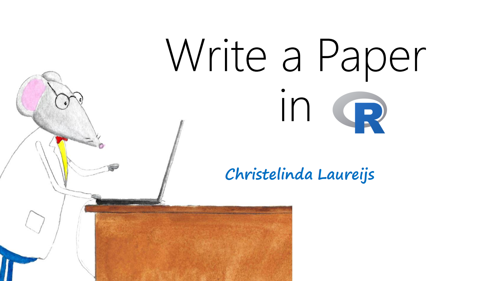

# Thesis Template

This repository contains everything you need to practice making a manuscript in R. It showcases some of the most common tasks you'll perform such as inserting figures, reporting statistics (both in tables and in-line), adding citations, inserting a title page, and customizing the appearance of your document.

## Resources

For a full guide on how to use this template, please see the presentation slides on [How to Write a Paper in R](How-to-Write-a-Paper-in-R-PDF.pdf).

For more detailed information, please read through [Getting-Started.pdf](Thesis/Getting-Started.pdf) and see how it's made with [Getting-Started.Rmd](Thesis/Getting-Started.Rmd).

If you want to try making your own paper, try knitting [sample-paper.Rmd](Thesis/sample-paper.Rmd)!

Other helpful resources:
[Open Science Skills in R](https://open-science-skills-in-r.netlify.app/)

[R Graphics Cookbook](https://r-graphics.org/)
