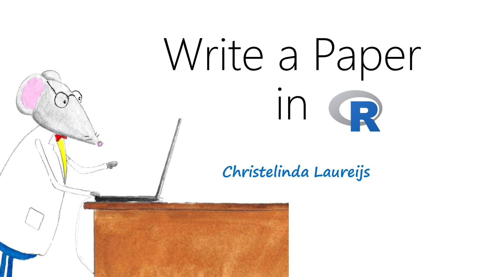

# You can write a paper in R!

This repository contains everything you need to practice making a manuscript in R. It showcases some of the most common tasks you'll perform such as inserting figures, reporting statistics (both in tables and in-line), adding citations, inserting a title page, and customizing the appearance of your document.

## How to Use this Repository

You will need RStudio and R to experiment with this code.
  
1. Click on the green *`<> Code`* button and download the ZIP folder. 
2. Unzip the folder to a location on your computer.
3. Double-click on the `sample-thesis.Rproj` file. It will open RStudio.
4. Go to `File -> Open file -> sample-paper.Rmd`.
5. RStudio will prompt you to install any packages that you don't already have. You will need these packages:

  * ggplot2
  * dplyr
  * here
  * broom
  * stringr
  * knitr
  
6. Click the `Knit` button and a PDF should pop open shortly!
7. If you receive error messages about not having a LaTeX installation, run the following code:

``` r
tinytex::install_tinytex()
```


## Resources

For a full guide on how to use this template, please see the presentation slides on [Writing a Paper in R](Writing-a-Paper-in-R-Presentation.pdf).

For more detailed information, please read through [Getting-Started.pdf](Thesis/Getting-Started.pdf) and see how it's made with [Getting-Started.Rmd](Thesis/Getting-Started.Rmd).

If you want to try making your own paper, try knitting [sample-paper.Rmd](Thesis/sample-paper.Rmd)!

Other helpful resources:

  * [Open Science Skills in R](https://open-science-skills-in-r.netlify.app/)
  * [R Graphics Cookbook](https://r-graphics.org/)
